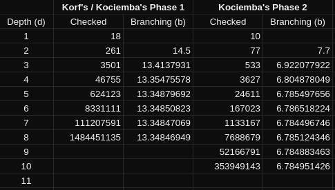

# Implementation  

## Structure  
`<insert a nice picture here>`

## Required moves  
- Me (a human): usually 100-150 moves  
- Simple algorithm: (not yet implemented)  
- Kociemba's algorithm: at most 30 moves  
- Korf's algorithm: at most 20 moves  

## Time and space complexities  
- Better to not know...
- O(b^d) => O(Oh no), (worst case: b = 13.4 and d = 20)

### Worst cases (at 200,000 positions per second)
My desktop computer with an AMD Ryzen 3800X at 4.35 GHz currently calculates
about 12,500 positions per second without optimizations or multithreading. But I
believe that the program could be optimized to be at least 16 times faster.

- Kociemba's algorithm:  
  - `18^12` and `10^18` positions without pruning. (`~160,000 years`)  
  - `~13.4^12` and `~6.8^18` positions with basic pruning. (`~160 years`)  
- Korf's algorithm:  
  - `18^20` positions without pruning. (`~2·10^12 years`)  
  - `~13.4^20` position with basic pruning. (`~5.5·10^9 years`)  

The numbers above assume that no position is checked twice, but the difference
really isn't too big. The actual count of positions for Kociemba's algorithm
without pruning would be `18^12 + 18^11 + 18^10 +  ... + 18^1` and
`10^18 + 10^17 + 10^16 + ... + 10^1` (`~180,000 years`)

## Possible flaws and improvements  
- The program is slow... `L i k e . . . r e a l l y . . . s l o w...`

## Sources:
- [Herbert Kociemba, The Two-Phase algorithm](http://www.kociemba.org/cube.htm)  
- [Richard E. Korf, Finding Optimal Solutions to Rubik's Cube](https://www.cs.princeton.edu/courses/archive/fall06/cos402/papers/korfrubik.pdf)  
