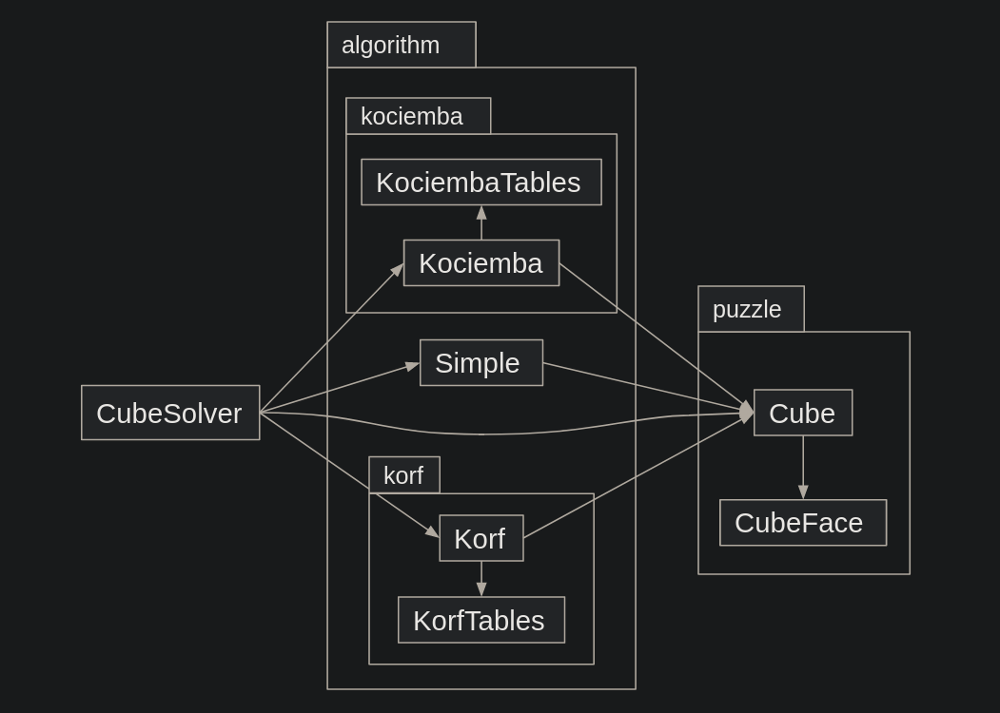

# Implementation  

## Structure  

## Required moves  
- Me (a human): usually 100-150 moves  
- Simple algorithm: (not yet implemented)  
- Kociemba's algorithm: at most 30 moves  
- Korf's algorithm: at most 20 moves  

## Time and space complexities  
- Better to not know...
- **Time complexity O(_b_^_d_)** (or O(_"Oh no"_) as I like to say.)  
  - Where _b_ is the branching factor and _d_ is the depth  
  - Worst case: b = 13.4 and d = 20 (Korf's algorithm)  
- **Space complexity O(1)**
  - The fixed size pruning tables take up the most space.  
  - Space complexity for the search is O(d) in the worst case but it will never 
    be even near the space required by the tables.  

### Worst cases (at 200,000 positions per second)
My desktop computer with an AMD Ryzen 3800X at 4.35 GHz currently calculates
about 17,000 positions per second without multithreading. But I believe that
the program could be optimized to be at least 12 times faster. And that is why
I chose 200,000 positions per second as the base.  

- Kociemba's algorithm:  
  - `18^12` and `10^18` positions without pruning. (`~160,000 years`)  
  - `~13.4^12` and `~6.8^18` positions with basic pruning. (`~160 years`)  
- Korf's algorithm:  
  - `18^20` positions without pruning. (`~2·10^12 years`)  
  - `~13.4^20` position with basic pruning. (`~5.5·10^9 years`)  

The numbers above assume that no position is checked twice, but the difference
really isn't too big. The actual count of positions for Kociemba's algorithm
without pruning would be `18^12 + 18^11 + 18^10 +  ... + 18^1` and
`10^18 + 10^17 + 10^16 + ... + 10^1` (`~180,000 years`)

## Possible flaws and improvements  
- The program is slow... `L i k e . . . r e a l l y . . . s l o w...`
  - There's no pruning tables at all with Kociemba's algorithm as I couldn't
    figure out how to calculate the symmetries.  
  - There are only partial pruning tables for Korf's algorithm as I couldn't
    get the generation fast enough.  
- A GUI would probably make the program a bit more accessible.  
- Even the binaries built with pyinstaller still require some external libraries
  to be installed.  
- Python as the language was a really bad choice.  
  - I only chose Python as I wanted to learn how to make larger programs with
    it.
  - I also thought that testing would take too much time with C++ and I didn't
    know Rust when this course started.  
  - Now I would probably choose Rust (even though I'm more familiar with C++).

## Sources:
- [Herbert Kociemba, The Two-Phase algorithm](http://www.kociemba.org/cube.htm)  
- [Richard E. Korf, Finding Optimal Solutions to Rubik's Cube Using Pattern Databases](https://www.cs.princeton.edu/courses/archive/fall06/cos402/papers/korfrubik.pdf)  
- [Ben Botto, Implementing an Optimal Rubik's Cube Solver using Korf's Algorithm](https://medium.com/@benjamin.botto/implementing-an-optimal-rubiks-cube-solver-using-korf-s-algorithm-bf750b332cf9)  
- [Wikipedia, Iterative deepening A*](https://en.wikipedia.org/wiki/Iterative_deepening_A*)  
